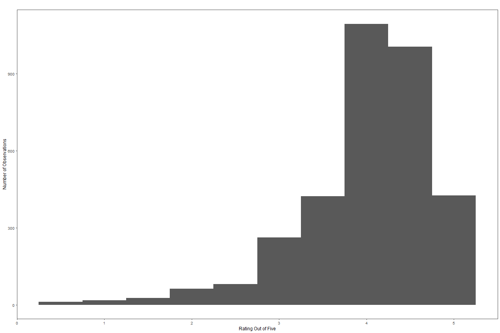
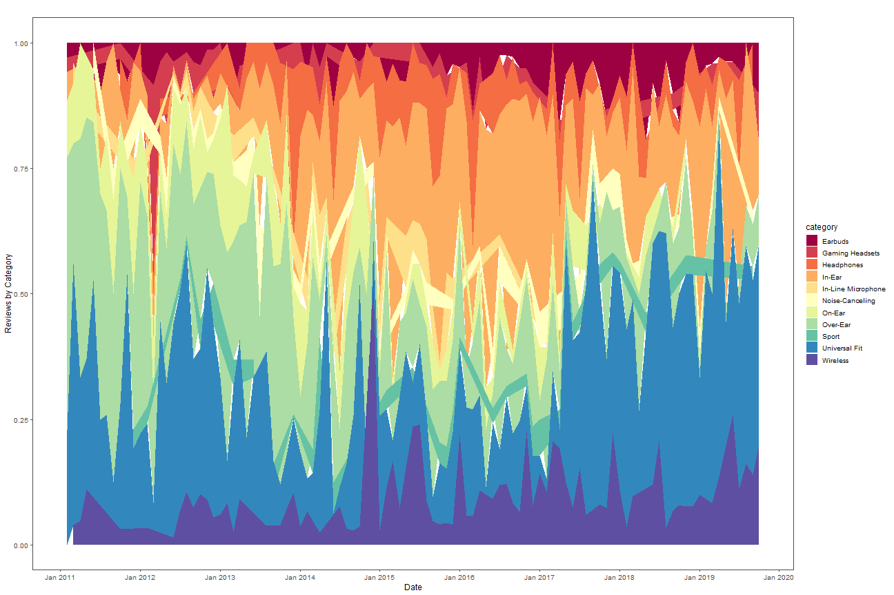
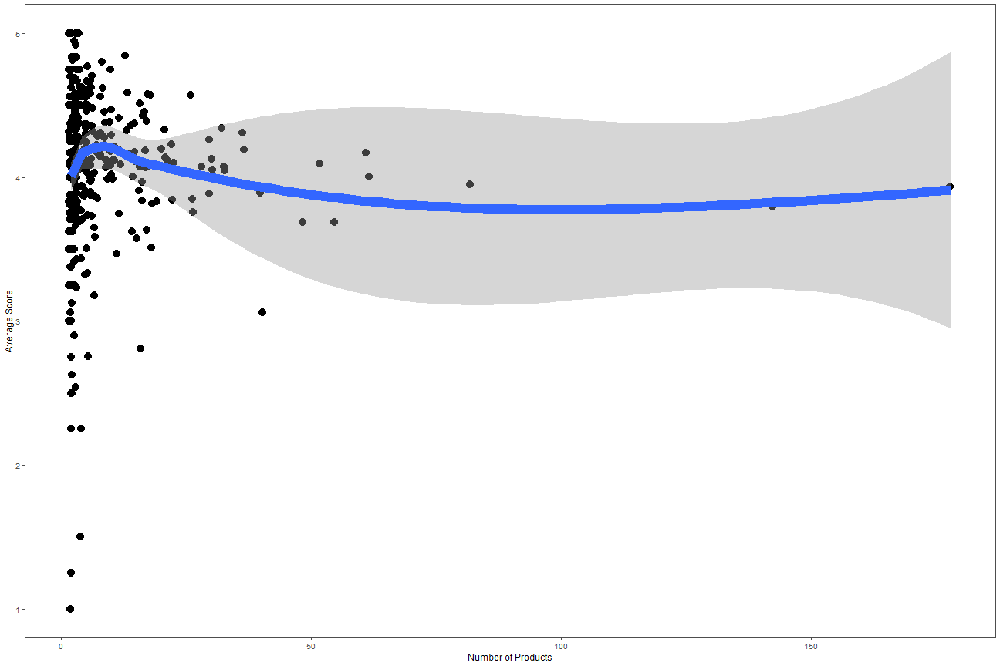

"Latent Dirichlet Allocation and Topic Modelling: A Link Between The Quantitative and Qualitative?"
========================================================
author: Kyle D. Weber
date: 10/28/2019
autosize: true

Basic Goal of Presentation
========================================================
Three goals:
- Introduce new dataset with detailed product information and examine predictors of review score 
- Explain and demonstrate topic modelling techinques, their output, etc
- Provide some context for how topic modelling can leverage non-quantitative information and ideas

Dataset Used
========================================================
Headfi.org is a website for portable audio enthusiasts.
- Higher traffic than competitors (whathifi.com, avforums.com, headphones.com, audioholics.com, etc.)
- Has discussion forum and separate review portal containing over 10K headphone reviews and descriptions for 7K products.
- Average reviewed product has 3.7 reviews.

Visualizing Distribution of Review Scores
========================================================



Evolution of Headphone Types By Year
========================================================



Which Brands Are Better and Worse Than Average?
========================================================

<table class="table" style="margin-left: auto; margin-right: auto;">
 <thead>
  <tr>
   <th style="text-align:left;">   </th>
   <th style="text-align:left;"> Different From Average? </th>
   <th style="text-align:left;"> P-Value </th>
   <th style="text-align:left;"> Which Direction? </th>
   <th style="text-align:left;"> Mean Value of Brand </th>
  </tr>
 </thead>
<tbody>
  <tr>
   <td style="text-align:left;"> akg </td>
   <td style="text-align:left;"> No </td>
   <td style="text-align:left;"> 0.2497 </td>
   <td style="text-align:left;"> N/A </td>
   <td style="text-align:left;"> 3.95 </td>
  </tr>
  <tr>
   <td style="text-align:left;"> apple </td>
   <td style="text-align:left;"> Yes </td>
   <td style="text-align:left;"> 0.0409 </td>
   <td style="text-align:left;"> Worse </td>
   <td style="text-align:left;"> 2.75 </td>
  </tr>
  <tr>
   <td style="text-align:left;"> audiotechnica </td>
   <td style="text-align:left;"> No </td>
   <td style="text-align:left;"> 0.5052 </td>
   <td style="text-align:left;"> N/A </td>
   <td style="text-align:left;"> 4.09 </td>
  </tr>
  <tr>
   <td style="text-align:left;"> beats </td>
   <td style="text-align:left;"> Yes </td>
   <td style="text-align:left;"> &lt;.01 </td>
   <td style="text-align:left;"> Worse </td>
   <td style="text-align:left;"> 2.81 </td>
  </tr>
  <tr>
   <td style="text-align:left;"> beyerdynamic </td>
   <td style="text-align:left;"> No </td>
   <td style="text-align:left;"> 0.1383 </td>
   <td style="text-align:left;"> N/A </td>
   <td style="text-align:left;"> 4.17 </td>
  </tr>
  <tr>
   <td style="text-align:left;"> bose </td>
   <td style="text-align:left;"> Yes </td>
   <td style="text-align:left;"> 0.0123 </td>
   <td style="text-align:left;"> Worse </td>
   <td style="text-align:left;"> 3.51 </td>
  </tr>
  <tr>
   <td style="text-align:left;"> brainwavz </td>
   <td style="text-align:left;"> No </td>
   <td style="text-align:left;"> 0.0603 </td>
   <td style="text-align:left;"> N/A </td>
   <td style="text-align:left;"> 3.89 </td>
  </tr>
  <tr>
   <td style="text-align:left;"> jvc </td>
   <td style="text-align:left;"> Yes </td>
   <td style="text-align:left;"> &lt;.01 </td>
   <td style="text-align:left;"> Worse </td>
   <td style="text-align:left;"> 3.69 </td>
  </tr>
  <tr>
   <td style="text-align:left;"> sennheiser </td>
   <td style="text-align:left;"> Yes </td>
   <td style="text-align:left;"> 0.0285 </td>
   <td style="text-align:left;"> Worse </td>
   <td style="text-align:left;"> 3.93 </td>
  </tr>
  <tr>
   <td style="text-align:left;"> skullcandy </td>
   <td style="text-align:left;"> Yes </td>
   <td style="text-align:left;"> &lt;.01 </td>
   <td style="text-align:left;"> Worse </td>
   <td style="text-align:left;"> 3.06 </td>
  </tr>
  <tr>
   <td style="text-align:left;"> sony </td>
   <td style="text-align:left;"> Yes </td>
   <td style="text-align:left;"> &lt;.01 </td>
   <td style="text-align:left;"> Worse </td>
   <td style="text-align:left;"> 3.79 </td>
  </tr>
</tbody>
</table>

Do Larger Brands Have Worse Ratings?
========================================================




What is Topic Modelling? (Pt. 1)
========================================================
- Basic idea:  Use statistics to examine which words tend to cluster together and identify topics and their presence by examining which clusters of words tend to appear together in a large body of texts.

- Advantages:
  - Can be used to generate descriptive statistics for more abstract concepts
  - Can analyze data at scale and speed human coders can't
  - Extremely accessible to non-practioners


What is Topic Modelling? (Pt. 2)
========================================================
- Key caveats: 
  - Requires additional interpretation
  - Need to guess number of topics to estimate
  - Topics not guaranteed to represent relevant concepts
  

Examining Words Associated with Product Descriptions
========================================================

<table>
 <thead>
  <tr>
   <th style="text-align:left;"> Topic 1 </th>
   <th style="text-align:left;"> Topic 2 </th>
   <th style="text-align:left;"> Topic 3 </th>
   <th style="text-align:left;"> Topic 4 </th>
   <th style="text-align:left;"> Topic 5 </th>
   <th style="text-align:left;"> Topic 6 </th>
   <th style="text-align:left;"> Topic 7 </th>
   <th style="text-align:left;"> Topic 8 </th>
   <th style="text-align:left;"> Topic 9 </th>
   <th style="text-align:left;"> Topic 10 </th>
  </tr>
 </thead>
<tbody>
  <tr>
   <td style="text-align:left;"> ear </td>
   <td style="text-align:left;"> ear </td>
   <td style="text-align:left;"> music </td>
   <td style="text-align:left;"> design </td>
   <td style="text-align:left;"> cabl </td>
   <td style="text-align:left;"> music </td>
   <td style="text-align:left;"> nois </td>
   <td style="text-align:left;"> high </td>
   <td style="text-align:left;"> new </td>
   <td style="text-align:left;"> driver </td>
  </tr>
  <tr>
   <td style="text-align:left;"> earphon </td>
   <td style="text-align:left;"> fit </td>
   <td style="text-align:left;"> bluetooth </td>
   <td style="text-align:left;"> qualiti </td>
   <td style="text-align:left;"> frequenc </td>
   <td style="text-align:left;"> can </td>
   <td style="text-align:left;"> cancel </td>
   <td style="text-align:left;"> comfort </td>
   <td style="text-align:left;"> product </td>
   <td style="text-align:left;"> high </td>
  </tr>
  <tr>
   <td style="text-align:left;"> cabl </td>
   <td style="text-align:left;"> comfort </td>
   <td style="text-align:left;"> wireless </td>
   <td style="text-align:left;"> color </td>
   <td style="text-align:left;"> driver </td>
   <td style="text-align:left;"> bass </td>
   <td style="text-align:left;"> listen </td>
   <td style="text-align:left;"> design </td>
   <td style="text-align:left;"> technolog </td>
   <td style="text-align:left;"> balanc </td>
  </tr>
  <tr>
   <td style="text-align:left;"> fit </td>
   <td style="text-align:left;"> design </td>
   <td style="text-align:left;"> control </td>
   <td style="text-align:left;"> ipod </td>
   <td style="text-align:left;"> respons </td>
   <td style="text-align:left;"> will </td>
   <td style="text-align:left;"> game </td>
   <td style="text-align:left;"> featur </td>
   <td style="text-align:left;"> qualiti </td>
   <td style="text-align:left;"> low </td>
  </tr>
  <tr>
   <td style="text-align:left;"> tip </td>
   <td style="text-align:left;"> use </td>
   <td style="text-align:left;"> time </td>
   <td style="text-align:left;"> bass </td>
   <td style="text-align:left;"> plug </td>
   <td style="text-align:left;"> like </td>
   <td style="text-align:left;"> system </td>
   <td style="text-align:left;"> headband </td>
   <td style="text-align:left;"> design </td>
   <td style="text-align:left;"> armatur </td>
  </tr>
  <tr>
   <td style="text-align:left;"> custom </td>
   <td style="text-align:left;"> cord </td>
   <td style="text-align:left;"> hour </td>
   <td style="text-align:left;"> ear </td>
   <td style="text-align:left;"> khz </td>
   <td style="text-align:left;"> get </td>
   <td style="text-align:left;"> use </td>
   <td style="text-align:left;"> listen </td>
   <td style="text-align:left;"> world </td>
   <td style="text-align:left;"> frequenc </td>
  </tr>
  <tr>
   <td style="text-align:left;"> isol </td>
   <td style="text-align:left;"> earbud </td>
   <td style="text-align:left;"> phone </td>
   <td style="text-align:left;"> comfort </td>
   <td style="text-align:left;"> imped </td>
   <td style="text-align:left;"> just </td>
   <td style="text-align:left;"> volum </td>
   <td style="text-align:left;"> perform </td>
   <td style="text-align:left;"> made </td>
   <td style="text-align:left;"> dynam </td>
  </tr>
  <tr>
   <td style="text-align:left;"> silicon </td>
   <td style="text-align:left;"> includ </td>
   <td style="text-align:left;"> call </td>
   <td style="text-align:left;"> player </td>
   <td style="text-align:left;"> sensit </td>
   <td style="text-align:left;"> good </td>
   <td style="text-align:left;"> featur </td>
   <td style="text-align:left;"> pad </td>
   <td style="text-align:left;"> one </td>
   <td style="text-align:left;"> diaphragm </td>
  </tr>
  <tr>
   <td style="text-align:left;"> monitor </td>
   <td style="text-align:left;"> carri </td>
   <td style="text-align:left;"> microphon </td>
   <td style="text-align:left;"> style </td>
   <td style="text-align:left;"> type </td>
   <td style="text-align:left;"> feel </td>
   <td style="text-align:left;"> level </td>
   <td style="text-align:left;"> adjust </td>
   <td style="text-align:left;"> first </td>
   <td style="text-align:left;"> hous </td>
  </tr>
  <tr>
   <td style="text-align:left;"> includ </td>
   <td style="text-align:left;"> size </td>
   <td style="text-align:left;"> devic </td>
   <td style="text-align:left;"> music </td>
   <td style="text-align:left;"> plate </td>
   <td style="text-align:left;"> sound </td>
   <td style="text-align:left;"> stereo </td>
   <td style="text-align:left;"> ear </td>
   <td style="text-align:left;"> develop </td>
   <td style="text-align:left;"> mid </td>
  </tr>
</tbody>
</table>

Examining Their Correlation With Rating Score
========================================================

<table class="table" style="margin-left: auto; margin-right: auto;">
 <thead>
  <tr>
   <th style="text-align:right;"> Topic 1 </th>
   <th style="text-align:right;"> Topic 2 </th>
   <th style="text-align:right;"> Topic 3 </th>
   <th style="text-align:right;"> Topic 4 </th>
   <th style="text-align:right;"> Topic 5 </th>
   <th style="text-align:right;"> Topic 6 </th>
   <th style="text-align:right;"> Topic 7 </th>
   <th style="text-align:right;"> Topic 8 </th>
   <th style="text-align:right;"> Topic 9 </th>
   <th style="text-align:right;"> Topic 10 </th>
  </tr>
 </thead>
<tbody>
  <tr>
   <td style="text-align:right;"> 0.0289536 </td>
   <td style="text-align:right;"> -0.1617635 </td>
   <td style="text-align:right;"> -0.0845823 </td>
   <td style="text-align:right;"> -0.1780946 </td>
   <td style="text-align:right;"> 0.0873286 </td>
   <td style="text-align:right;"> -0.0839854 </td>
   <td style="text-align:right;"> -0.1563137 </td>
   <td style="text-align:right;"> -0.0173788 </td>
   <td style="text-align:right;"> 0.0953731 </td>
   <td style="text-align:right;"> 0.2458633 </td>
  </tr>
</tbody>
</table>

Examining Their Correlation With the Probability of Being Reviewed
========================================================

<table class="table" style="margin-left: auto; margin-right: auto;">
 <thead>
  <tr>
   <th style="text-align:right;"> Topic 1 </th>
   <th style="text-align:right;"> Topic 2 </th>
   <th style="text-align:right;"> Topic 3 </th>
   <th style="text-align:right;"> Topic 4 </th>
   <th style="text-align:right;"> Topic 5 </th>
   <th style="text-align:right;"> Topic 6 </th>
   <th style="text-align:right;"> Topic 7 </th>
   <th style="text-align:right;"> Topic 8 </th>
   <th style="text-align:right;"> Topic 9 </th>
   <th style="text-align:right;"> Topic 10 </th>
  </tr>
 </thead>
<tbody>
  <tr>
   <td style="text-align:right;"> 0.0375056 </td>
   <td style="text-align:right;"> -0.2319111 </td>
   <td style="text-align:right;"> 0.0074913 </td>
   <td style="text-align:right;"> -0.1880465 </td>
   <td style="text-align:right;"> 0.169379 </td>
   <td style="text-align:right;"> -0.0340158 </td>
   <td style="text-align:right;"> -0.1565093 </td>
   <td style="text-align:right;"> -0.0224978 </td>
   <td style="text-align:right;"> 0.1108324 </td>
   <td style="text-align:right;"> 0.2502298 </td>
  </tr>
</tbody>
</table>

Most Common Topics for Major Brands
========================================================


```
Error in dimnames(x) <- dn : 
  length of 'dimnames' [2] not equal to array extent
```
